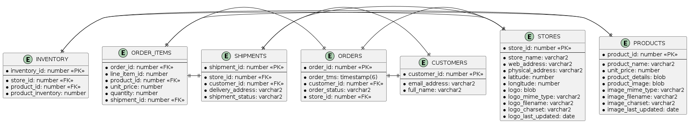
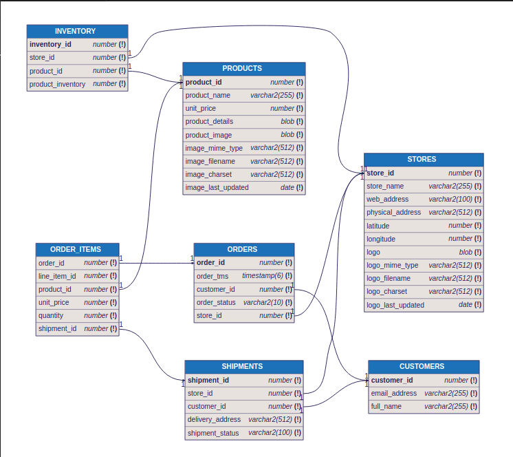

# ora-octopus-schema-gen

## Introduction

Outil permettant de générer un fichier [octopus schema](https://github.com/lechuckroh/octopus-db-tool/blob/master/docs/octopus-format.md), schéma de base de données générique. 

En se connectant à une base Oracle via :

```bash
ORACLE_URL="oracle://${ORACLE_USER_NAME}:${ORACLE_USER_PASSWORD}@${ORACLE_HOSTNAME}:${ORACLE_PORT}/${ORACLE_SERVICE_NAME}" 
```

## Docker compose

```bash
docker compose up
```

## Oracle account

```bash
Hostname:
    oracle (from within another container)
    localhost or 127.0.0.1 (from the host directly)
Port: 1521
Service name: FREEPDB1

Database Admin User: system
Database Admin User Password: $ORACLE_PASSWORD
Database App User: $APP_USER
Database App User Password: $APP_USER_PASSWORD
```

## .env

```bash
ORACLE_SERVICE_NAME=FREEPDB1
ORACLE_USER_NAME=system
ORACLE_USER_PASSWORD=password
ORACLE_HOSTNAME=localhost
ORACLE_SCHEMA_NAME=demo
ORACLE_PORT=1521

ORACLE_URL="oracle://${ORACLE_USER_NAME}:${ORACLE_USER_PASSWORD}@${ORACLE_HOSTNAME}:${ORACLE_PORT}/${ORACLE_SERVICE_NAME}"
```


## Generate schema from "sql/customers_orders/co_create.sql"

```bash
cd examples
make generate-schema
make plantuml
make dbml
```


### https://www.plantuml.com/plantuml

* [./examples/ora-model.plantuml](./examples/ora-model.plantuml)



### https://dbdiagram.io

* [./examples/ora-model.dbml](./examples/ora-model.dbml)




## References

* https://github.com/lechuckroh/octopus-db-tool